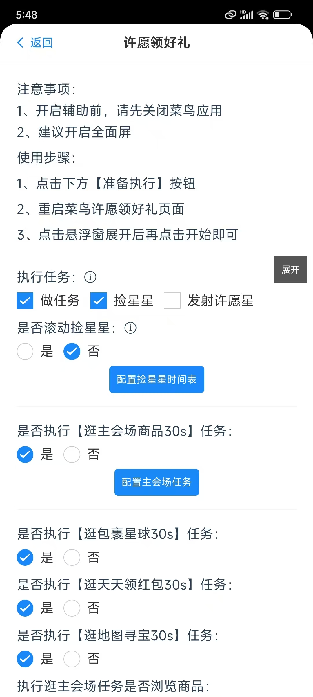
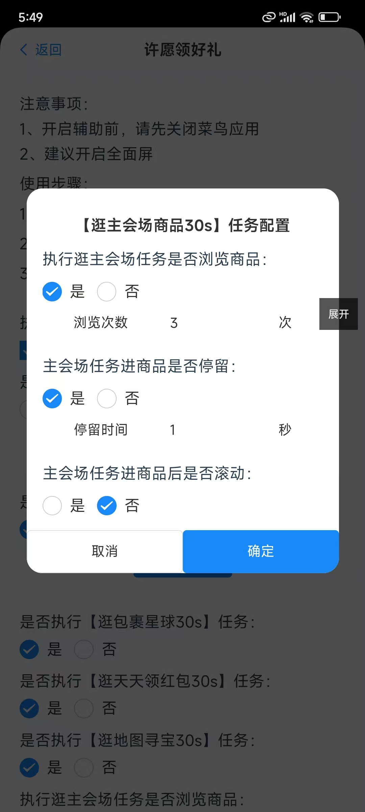

### 前言
主任务在许愿领好礼中获取星星是最多的，所以做好这个任务今天一天中奖的概率就会提升，有说星星要拿的多，得多看商品，看了商品得滚动、看了商品得停留一会，点击商品立即回退，有好多不同的意见，于是我加了一些配置，可以让大家自主选择。

### 使用方式

#### 1、进入许愿领好礼界面
  
  

#### 2、点击配置主会场任务
  
  
  1.配置【执行逛主会场任务是否浏览商品】  
  选择否，在执行主任务的时候不会浏览商品，选择是则会浏览列表页面会随机点击商品  
  2.配置【主会场任务进商品是否停留】  
  选择否，在点击进入商品后会直接退出，选择是在点击商品后会停留设置的时间，单位是秒  
  3.配置【主会场任务进商品后是否滚动】  
  选择否，在进入商品详情页面后停留上面配置的时间后再退出，选择是，会滚动配置的次数

#### 3、点击确定

#### 4、点击准备执行任务

#### 5、跳转到菜鸟app 许愿领好礼界面

#### 6、点击悬浮窗开始即可

### 常见问题
1、这个配置了是否能提高星星的获取概率？  
每个用户的情况不一样，可能对应一些用户来说，是有用的，对于另外一些用户来说，只要点击商品详情就可以，因用户而异，项目有默认的配置，仅供参考。
