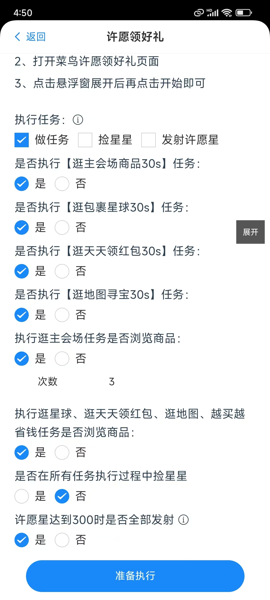

### 前言
在许愿领好礼活动中有很多的任务需要在日常中去完成，比如主会场浏览任务、天天任务，捡星星任务等等，在悠然助手许愿版里已经把大部分任务给涵盖了，要做什么任务可以直接在配置里配置即可。

### 使用方式

#### 1、进入许愿领好礼界面
  
  

根据选项内容进行选择任务。

#### 2、点击下面准备【执行按钮】

#### 3、打开菜鸟APP，进入到许愿领好礼界面

#### 4、最后一步，打开悬浮窗口，再点击开始即可
  
  

#### 常见问题：
1.我点击开始了 但是任务没有自动执行？
  
  建议把菜鸟app重启一下，菜鸟app需要在悠然助手启动后再启动，因为有些手机兼容性不一样。如果这种方式还不行，上报一下日志，把问题描述清楚，作者会在第一时间去解决问题
