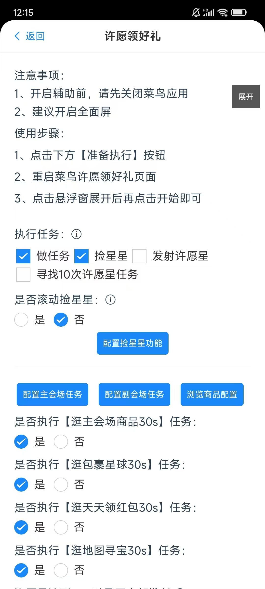
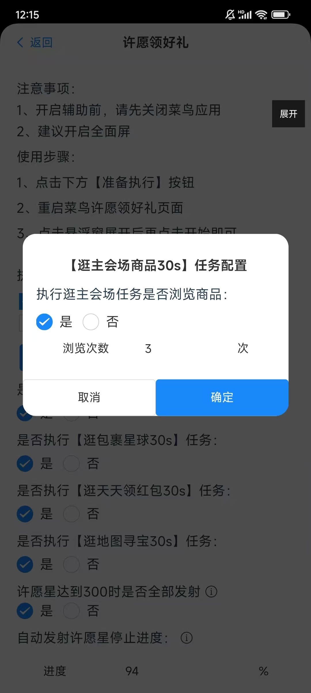
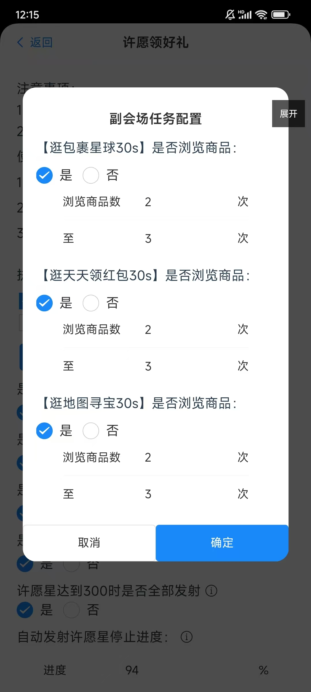
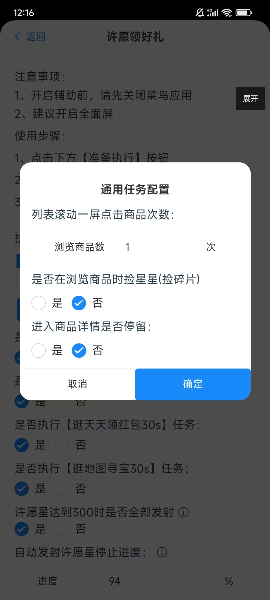
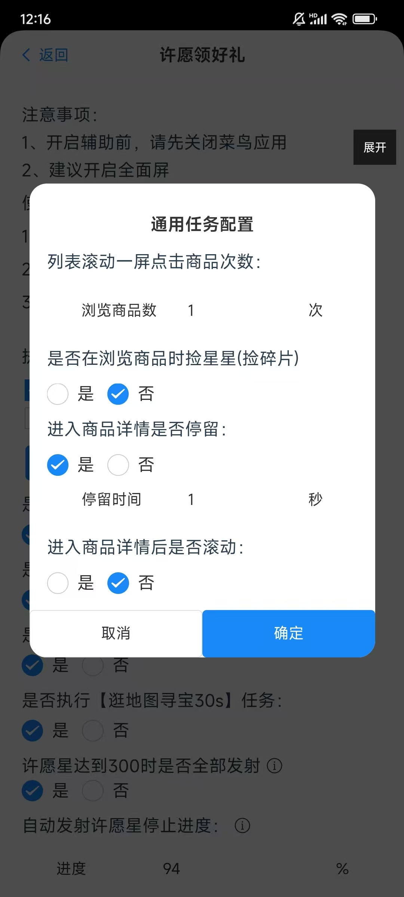
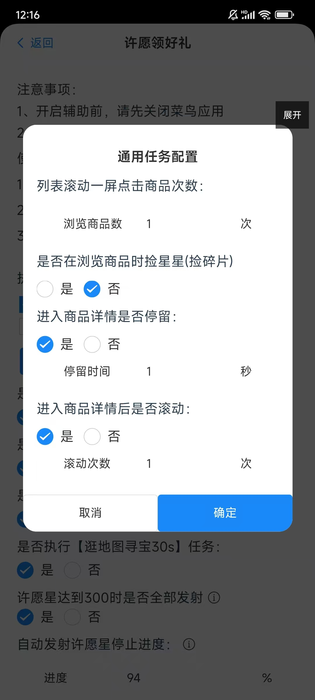

### 前言
在许愿领好礼活动中有很多的任务需要在日常中去完成，比如主会场浏览任务、天天任务，捡星星任务等等，在悠然助手许愿版里已经把大部分任务给涵盖了，要做什么任务可以直接在配置里配置即可。

### 使用方式

#### 第一步、进入许愿领好礼界面
  
  
  
  配置介绍：
##### 1、是否执行【逛主会场商品30s】任务、是否执行【逛包裹星球30s】任务、是否执行【逛天天领红包30s】任务、是否执行【逛地图寻宝30s】任务。  
选择是，在执行任务的时候，则会执行该任务；选择否的话，在执行任务的过程则会跳过这个任务  
##### 2、配置主会场任务  
点开后是这样的配置  
  

a、执行逛主任务是否浏览器商品  
选择否，在执行主任务的时候不会自动浏览商品，选择是，在执行主任务的时候会自动浏览商品，并且可以配置浏览商品次数

##### 3、配置副会场任务
点开后是这样的配置  
  
a、【逛包裹星球30s】是否浏览商品、【逛天天领红包30s】是否浏览商品、【逛地图寻宝30s】是否浏览商品  
选择否，在执行对应任务的时候不会自动浏览商品，选择是，在执行对应任务的时候会自动浏览商品，并且可以配置浏览商品次数，次数为配置里的随机次数

##### 4、浏览商品配置
点开后是这样的配置  
    
这个配置项对于主任务与副任务都生效。
a、列表滚动一屏点击商品次数  
在执行任务的时候，列表滚动一屏时，需要点击的商品次数，比如在一屏中有6个商品，如果配置了3个的话，则会点击当前屏幕中的3个商品，这样就可以达到在30秒内完成5、6个商品浏览任务  

b、是否在浏览商品时捡星星(捡碎片)  
选择是，则在执行任务的过程中发现红条后，会自己捡星星；选择否，则不会捡星星  
c、进入商品详情是否停留  
默认否，不停留。选择是后 效果图如下：  

     

      

可以配置停留时间，即进入商品后，不会立即退出，而是会等待配置的几秒后退出  
另外一个配置：进入商品详情后是否滚动  
默认否，不滚动。选择是后，可以配置滚动次数，即进入商品后，会滚动几次，如果这个地方配置选择了是，则上面的停留时间，不再生效，即滚动完后立即退出当前商品详情页面。

#### 第二步、点击下面准备【执行按钮】

#### 第三步、打开菜鸟APP，进入到许愿领好礼界面

#### 第四步、最后一步，打开悬浮窗口，再点击开始即可  
或者点击悬浮窗口，做任务即可。

#### 常见问题：
1.我点击开始了 但是任务没有自动执行？
  
  建议把菜鸟app重启一下，菜鸟app需要在悠然助手启动后再启动，因为有些手机兼容性不一样。如果这种方式还不行，上报一下日志，把问题描述清楚，作者会在第一时间去解决问题
