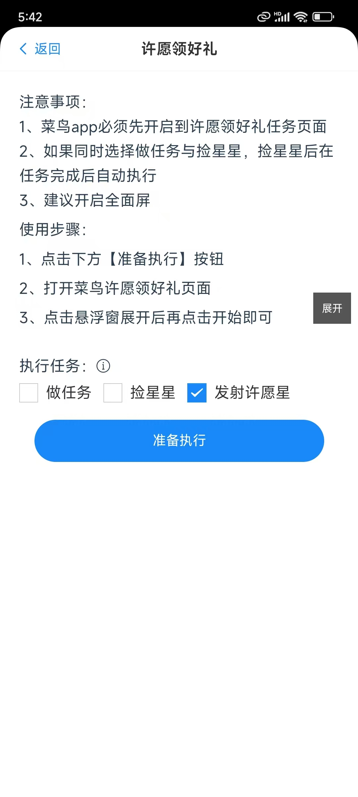

### 前言
许愿领好礼中在领了300颗星星后，便无法再继续领取了，这个时候就需要用户去发射星星，星星发射后，可以概率获取选项中的3个奖品，在悠然助手许愿版中怎么方便执行发射星星呢？

### 使用方式

#### 1、打开悠然助手许愿版菜鸟许愿领好礼管理页面

  
  选择发射许愿星

#### 2、点击下方按钮准备执行

#### 3、打开到许愿领好礼页面

#### 4、到菜鸟许愿领好礼页面点击悬浮窗【开始】按钮即可

### 常见问题
1.我看到悬浮窗里也有发射的按钮，是否可以点击那里发射呢？
  
  这个地方的按钮是可以点击发射，但是当悠然助手许愿版运行太久之后，会导致点击此按钮无效，所以建议还是通过上述的方式进行启动，后续如果有解决方式也会及时更新此功能