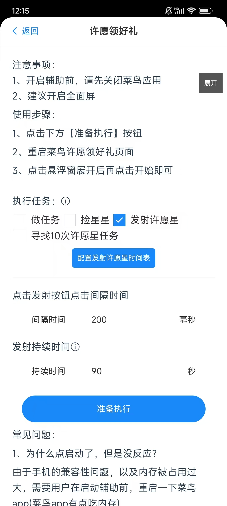

### 前言
许愿领好礼中在领了300颗星星后，便无法再继续领取了，这个时候就需要用户去发射星星，星星发射后，可以概率获取选项中的3个奖品，在悠然助手许愿版中怎么方便执行发射星星呢？

### 使用方式

#### 第一步、打开悠然助手许愿版->许愿领好礼

#### 第二步、选择发射许愿星 -> 根据信息修改相关配置

  

  配置说明：  
  ##### 1、点击发射按钮点击间隔时间  
  即在许愿领好礼页面点击发射按钮的间隔时间，单位为毫秒，默认为200毫秒，这个时间不建议大家配置太短，最少100毫秒，100到200毫秒的时间比较适合在水点抢射时候配置，平时非水点时间，建议拉到长1000毫秒  
  ##### 2、发射持续时间
  点击发射按钮的持续时长，比如配置了90秒，那么在开始后的90秒内会持续发射，过了时间则停止。

#### 第三步、点击下方按钮准备执行

#### 第四步、打开到许愿领好礼页面

#### 第五步、到菜鸟许愿领好礼页面点击悬浮窗【开始】按钮即可
当然也可以点开悬浮窗，点击发射星，也是一样可行的

### 常见问题
1.我看到悬浮窗里也有发射的按钮，是否可以点击那里发射呢？
  
  这个地方的按钮是可以点击发射，但是当悠然助手许愿版运行太久之后，会导致点击此按钮无效，所以建议还是通过上述的方式进行启动，后续如果有解决方式也会及时更新此功能