## 前言
在使用悠然助手许愿版本中总会有一些问题，下面就来统计一下在使用过程经常碰到的问题。

### 1.下载打开为什么是压缩文件？
比如说：这是样的  

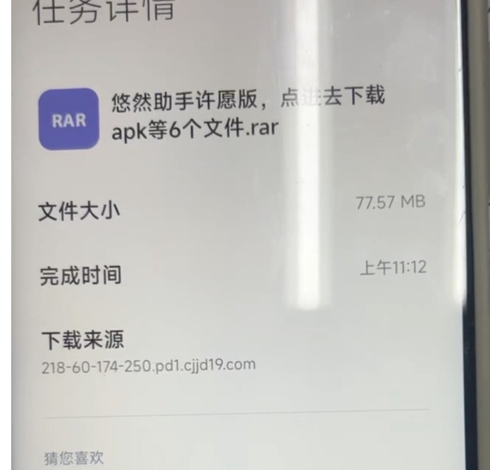  

这个其实是压缩文件，不应该下载文件夹，应该要点进去下载apk，在浏览器打开下载页面后，点击一下下面这片区域：  
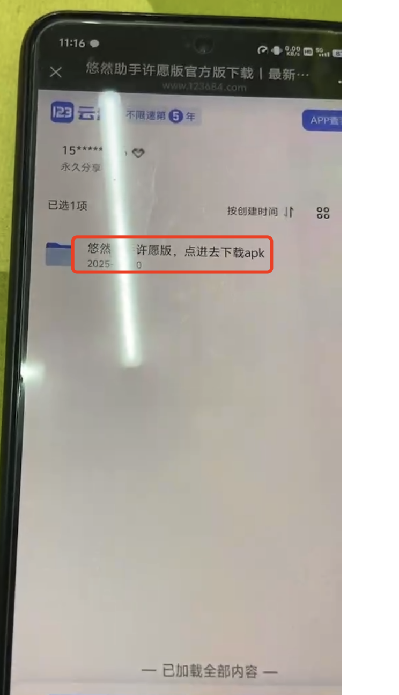  
到里面后，下载1.0.2.apk。不懂的话 可以看看[开始使用](/wish/uyueasx9/)，看看视频教程。

### 2.为什么我点击下载文件没有反应？
比如说，我在微信中点开了下载的链接：  
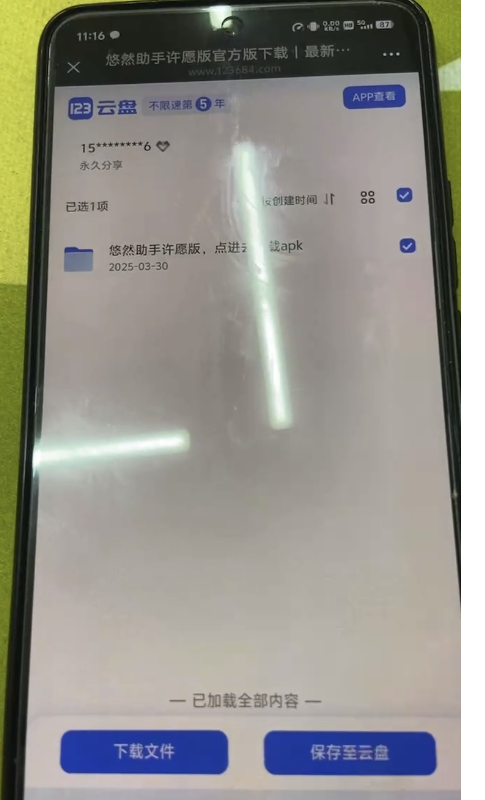  
我也点到里面选择了1.0.2.apk，但是却没有反应？  
这个是因为微信的浏览器不支持下载文件，我们需要点击右上角的3个点，选择在浏览器中打开，再去下载~  
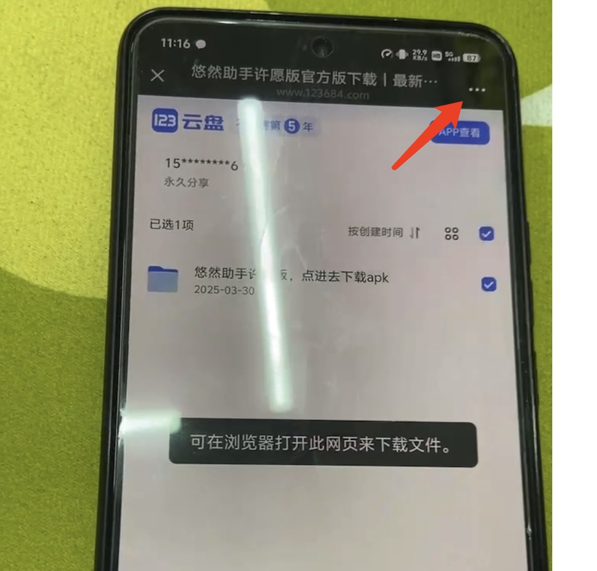  
这样就可以正常下载使用啦~

### 3.为什么悬浮窗没有出现呢？
没出现悬浮窗口的原因有以下几种
原因1、没有给悬浮窗口权限。  
大部分手机长按悠然助手的图标的时候会出现应用详情，点进去，找到权限(或者类似的)，找到悬浮窗，开启即可。  
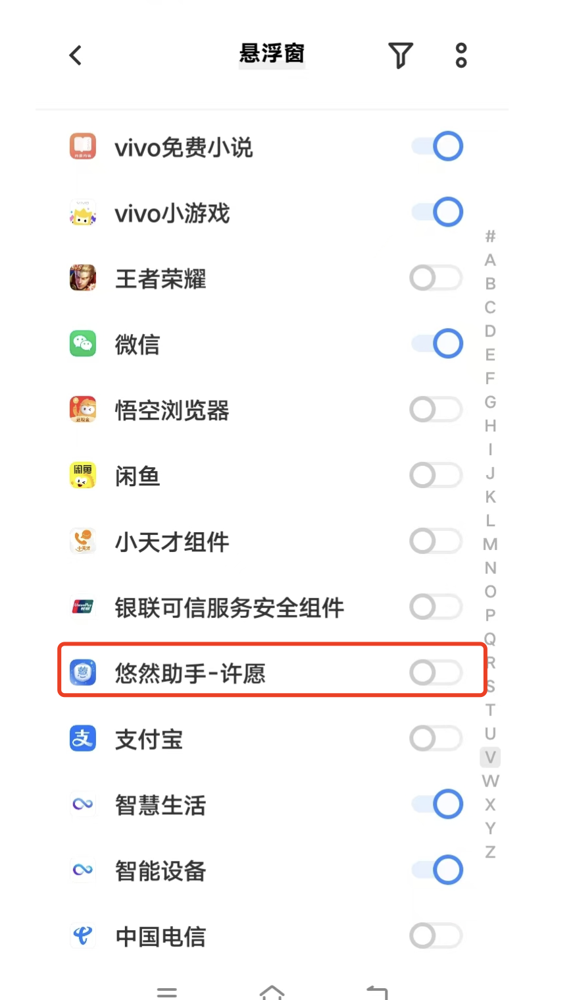  
原因2、没有进入到悠然助手许愿版内页。
在悠然助手许愿版1.7.0版本中，需要进入到准备页面才会弹出悬浮窗权限，即需要进到此准备页面：

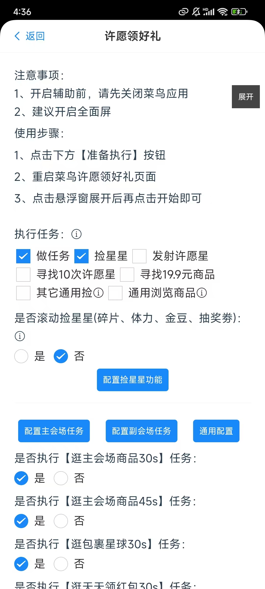  

进了之后才会有悬浮窗

### 4.为什么无障碍权限出现了问题？

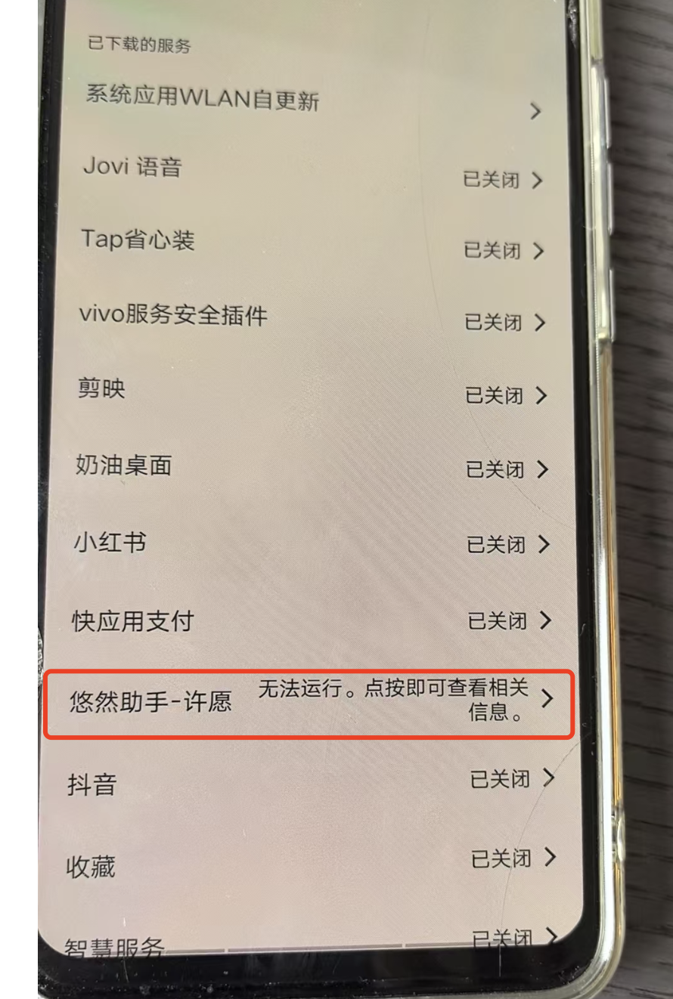  

这个情况下无障碍开启是失败的，这个时候如果启动悠然助手辅助的话，会启动失败，无法正常执行。
解决方式也很简单：点进去，把无障碍开启关闭2次。

### 5.小米手机、摩托摩拉在启动无障碍不让点？
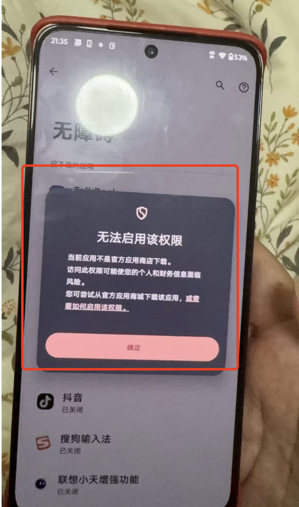  

点击出现这个错误。这个是因为应用商城没有上架，所以会有一些限制，这个只要把其权限开起来就可以。  

长按悠然助手应用图标->应用信息->滚动到最下面 把开头开起来：  
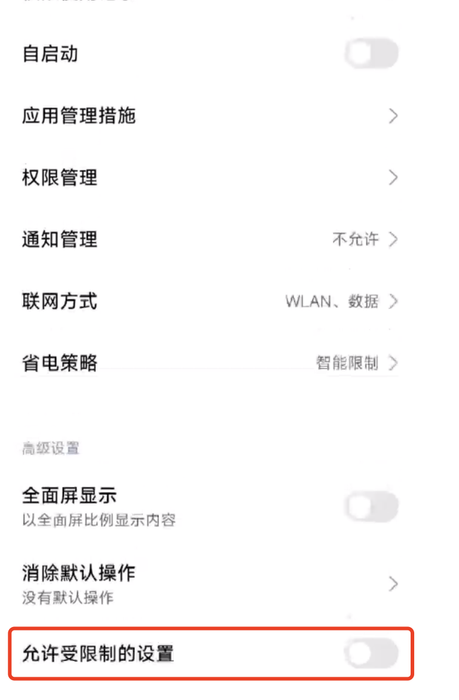  
当前如果没有这个东西的话，找找右上角是不是有3个点，点进去看看有没有相关的开关配置  

### 6.我在启动悠然助手的时候明明已经给了无障碍权限，但是点击悬浮窗口里的开始还是跳转无障碍权限页面，为什么？
问题描述：在启动悠然助手的时候，已经给了无障碍权限，把开关开起来了，然后点击准备执行，到了菜鸟许愿页面，我点击开始，但是并没有直接开始，而是跳转到了无障碍权限页面，这是为什么？  
#### 原因：可能是因为无障碍权限没有真正授予。  
#### 解决：在开始启动无障碍的时间，把无障碍开关开启关闭2次。如果这个方式也解决不了，可以尝试前置无障碍权限，视频教程：
[给悠然助手前置赋予无障碍权限](https://mp.weixin.qq.com/s/cKsbBIE9qd_M_4BlOeQCYA)

### 7.为什么我在做副任务的时候一直浏览商品不会返回？

这个原因大概率是菜鸟版本的问题，看看菜鸟的版本是不是最新版本8.10.423(目前的最新版本,5月6号)，如果不是的话，建议升级试试。

### 8.为什么在做副任务的过程中(尤其是跑了很久的任务后)，会突然退出许愿页面？
这个原因有很多，有可能是因为代码bug的问题，不过经过这几轮的测试排查问题，很大概率是因为没有正常识别文字导致的，这个没有正常识别，可能是因为跑久了，导致内存占用高了(cn跑任务会占用很大的内存)，当然根本原因在于，软件的功能限制性，但是这个限制还真处理不了。  
#### 解决方案：
只能盯着，如果碰到退出的情况，记得手动再进入许愿页面，再重开一下辅助。

### 9. 黑号了，想把激活码换到其它设备上跑，怎么换？
可以参考这个教程：[重置激活码](/wish/95quqflo/)

### 10.无法给悠然助手app权限？
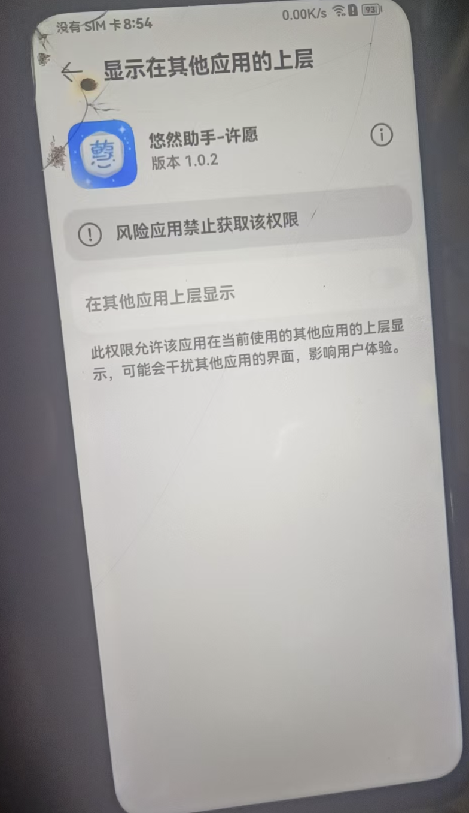  

这类问题基本只在华为手机上出现。
#### 解决方案：
设置-> 搜索管控，找一下悠然助手有没有被管控，有的话，解除管控即可。  
如果设置里没有找到管控的话，找一下系统的应用，系统管家或者手机管家，找一下病毒，点进去，把悠然助手解除一下。  

可以参考一下 [华为手机从下载到安装使用视频教程](https://mp.weixin.qq.com/s/QkSbiKFHLAaL5dC7RaiMzA)

### 11.下载后没办法打开
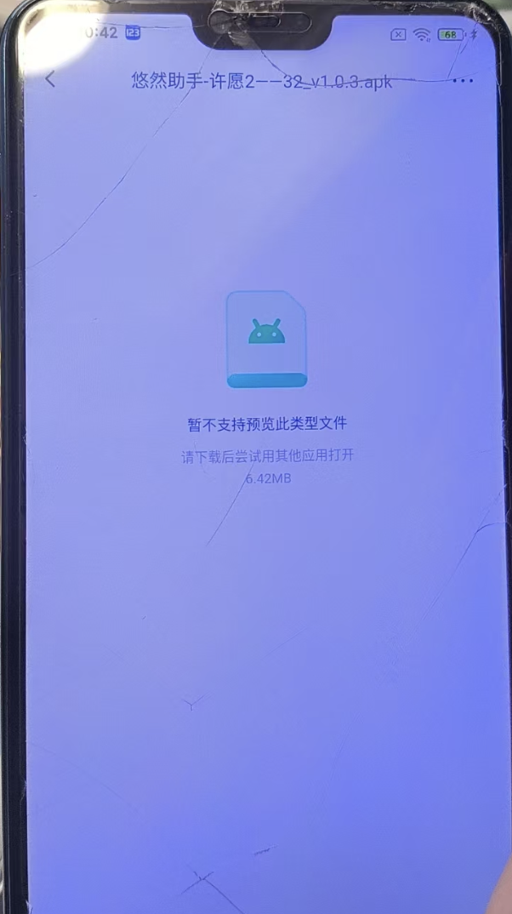  
如上图。  
这个其实是因为你是在123网盘中下载的，在123网盘中下载后，需要到本地去打开安装，在网盘内是没办法安装apk的。  
简单一些的方式，把下载链接复制后，到浏览器中打开，然后下载，具体可以参考[开始使用](/wish/uyueasx9/)中的视频教程
