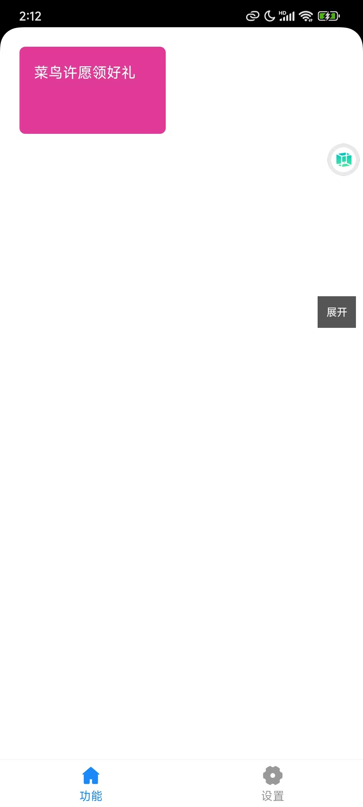
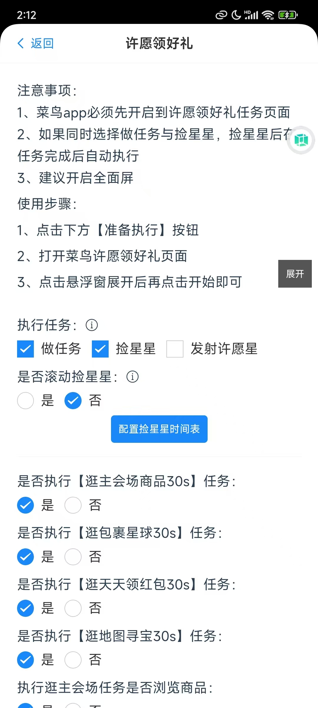
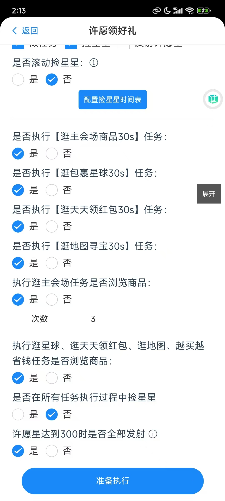

### 从这里开始
---
##### 注意 新版本更新后 悬浮窗口只在激活成功后展示~

[小米等手机从下载到安装使用视频教程参考](https://mp.weixin.qq.com/s/9cliRJopLnZ3K2kTxVrdFA)  

[华为手机从下载到安装使用视频教程](https://mp.weixin.qq.com/s/QkSbiKFHLAaL5dC7RaiMzA)

[vivo手机从下载到安装使用视频教程](https://mp.weixin.qq.com/s/1Tr32A8Vu359CrvOgw8h6Q)

### 其它任务参数说明：
[捡星星](/wish/6rl2v7cd/)  
[做任务](/wish/7jh8tbf9/)  
[找19.9](/wish/eem2vvlw/)  
[发射星星](/wish/2stwe2is/)  
[重置激活码](/wish/95quqflo/)  
[通用捡星](/wish/uxy9z2dm/)  
[某宝刷视频](/wish/6r05pyy4/)  
[抢红包](/wish/5xix33jo/)  
[悬浮窗快捷操作说明](/wish/xkbfxdva/)

### 开始使用
前置：在下载完毕之后，便是激活了。但是在激活之前我们要给予3个权限。  

悠然助手许愿版需要用到无障碍权限、悬浮窗权限、存储权限，在进入应用的时候确认已经给应用赋予权限  
菜鸟版本：8.10.423，更新到最新版本(目前最新版本即是8.10.423)，建议锁定这个版本后就不要再更新了，后续会测试cn最新版本是否支持悠然助手许愿版。
如果没有这个版本的话，可以在这里[下载此版本的菜鸟](https://www.123684.com/s/ajKVVv-Ea0gA)

  #### 第一步：输入激活码激活：
  打开悠然助手后，即可输入激活码：  

    

  输入购买的激活码，点击提交即可

   #### 第二步：进入许愿领好礼模块：
  

  #### 第三步：选择选项配置：
  

  #### 第四步：点击下方按钮准备执行
  

  #### 第五步：打开菜鸟许愿领好礼应用(最好重进一下许愿领好礼页面)
  
  点击悬浮窗开始按钮即可或者点击悬浮窗其它按钮

### 常见问题
1.打开悠然助手许愿版后，怎么不会熄屏？  
这是因为在悠然助手中有一个功能，捡星星，因为这个功能需要屏幕觉亮，如果用户需要熄屏，建议手动熄屏。   
2. 悠然助手激活码激活提示超过最大激活次数了？  
   悠然助手安装后别轻易卸载，因为更新的内容不需要重装apk，只需要重新启动悠然助手即可，理论上同一个手机重装后只会占用1次激活次数，但是有一些手机重装后会占用两次激活次数，所以平常在使用成功激活后，别轻易卸载，不然会出问题~
  
[其它常见问题梳理](/wish/way70hsi/)