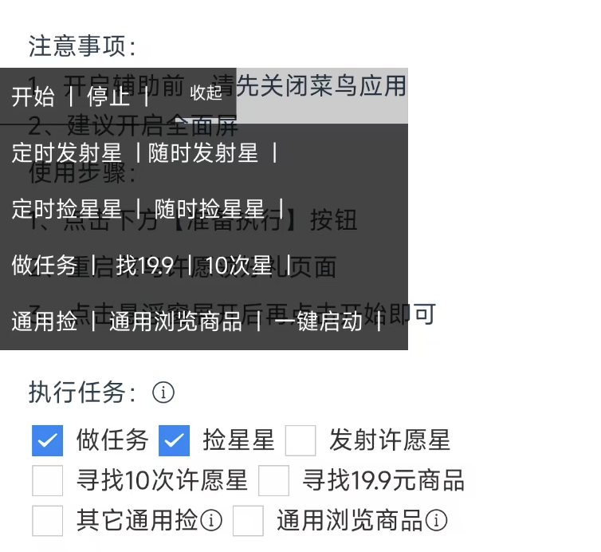

### 前言
悠然助手许愿版悬浮窗口有很多快捷方式，下面就一一来介绍每个快捷方式的作用。  

---

1. 开始、停止。
   在悠然助手中点击准备执行后，可以通过点击【开始】按钮来启动已经准备好的待执行代码；【停止】则是停止当前在执行的代码。  
   比如如果要启动【某宝刷视频】，需要先进入到【[某宝刷视频](/wish/6r05pyy4/)】，点击【准备执行】，再点击悬浮窗【开始】
---
##### 注意：以下快捷仅在点击【许愿领好礼】内的【准备执行】才生效
2. 定时发射星
   在【许愿领好礼】配置好发射许愿星的时间后，点击【定时发射星】，即可在指定配置时间点发射许愿星。
3. 随时发射星
   点击【随时发射星】，即可在任意时间点发射许愿星，不受配置好的时间限制。
4. 定时捡星星
   在【许愿领好礼】配置好捡星星的时间后，点击【定时捡星星】，即可在指定配置时间点捡星星。
5. 随时捡星星
   点击【随时捡星星】，即可在任意时间点捡星星，不受配置好的时间限制，但是会受捡星星里的配置约束，比如进度、刷新时间，延迟时间等
6. 做任务
   这个是针对【许愿领好礼】任务的，点击此快捷方式后，会开始做许愿任务，需要先去到许愿页面，然后再点击开始
7. 找19.9
   是指找配置好的价格，点击后，会不断的向下滚动找指定的价格
8. 10次星
   把10次星星任务单独提出来了，可以通过此快捷方式直接启动【浏览寻找10次许愿星】任务
9.  通用捡
   具体参考[通用捡](/wish/uxy9z2dm/)。点击【通用捡】后，即开始直接执行此任务
10. 通用浏览商品
   具体参考[通用浏览商品](/wish/3hyq7wgr/)。点击【通用浏览商品】后，即开始直接执行此任务
11. 一键启动
    一键启动把做任务与捡星星融合了一起，做任务的过程中，如果到达了配置好的捡星星时间，则会自动触发捡星星。一键启动的配置项在悠然助手许愿领好礼准备页面是没有的，但是他是受限于【做任务】与【捡星星】的配置。