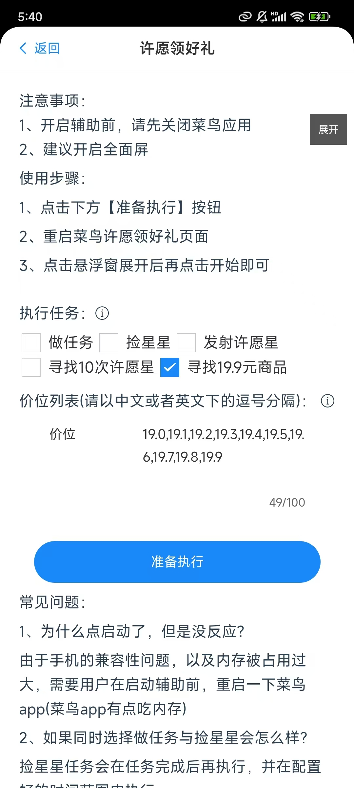

### 前言
在正式开启一天许愿的时候，需要寻找一些指定价格的商品，这个功能能够让朋友们找到自己指定价格的商品。

### 使用方式

#### 第一步、打开悠然助手许愿版->许愿领好礼

#### 第二步、选择【寻找19.9元商品】
    

配置说明：  
1、【价位列表】  
这个是指你要去寻找商品的价位，默认配置了19.0到19.9。当然你可以通过这个配置去找其它价位的商品，比如我要找149.9、249.9元的商品，但是1次只能找配置好的其中1个，比如配置了19.0，149.9，249.9，这几个价格，当辅助找到了149.9元时就会停止继续寻找其它价格的商品了，所以如果想寻找19.0与249.9的话，需要把149.9价位删除了。  
注意：每个价格之间只能用 英文的逗号(,)或者中文下的逗号(，)

#### 第三步、点击下方按钮准备执行

#### 第四步、打开到许愿领好礼页面->点击【更换心愿好礼】

#### 第五步、点击悬浮窗【开始】按钮即可
或者点击悬浮窗口里的【找19.9】也可以