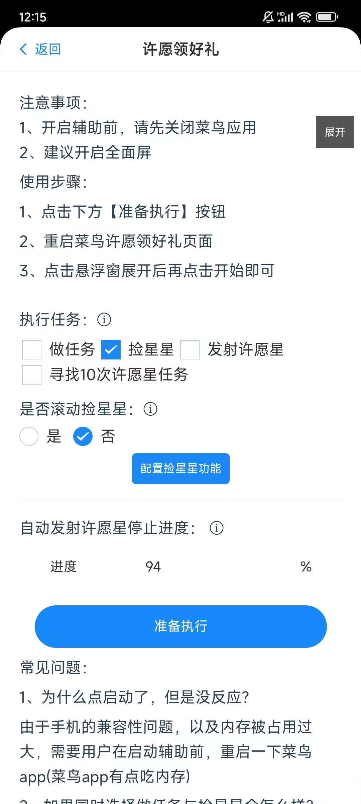
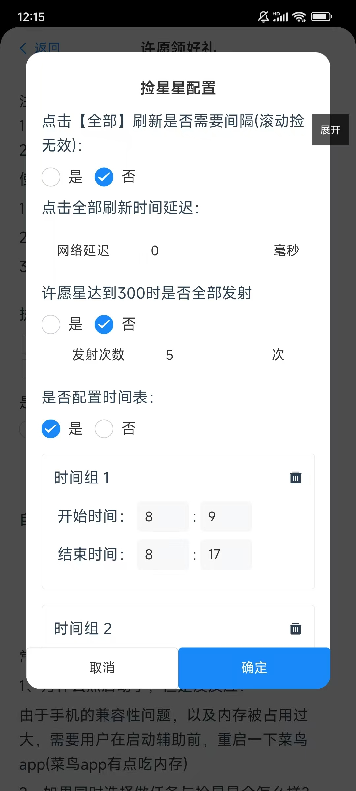
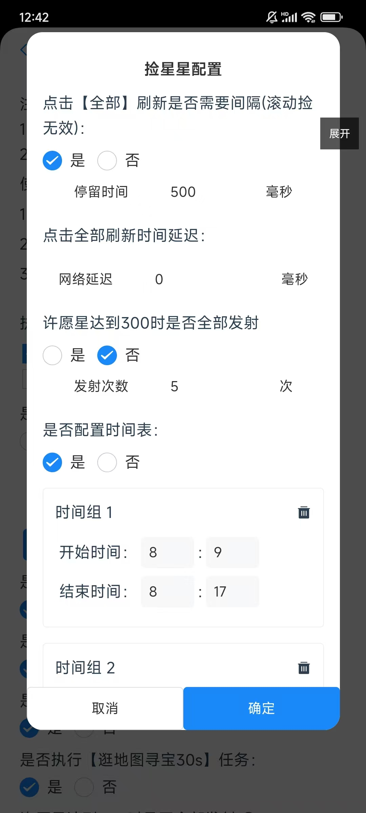

### 前言
许愿领好礼任务中捡星星是每日获取大量星星的途径，获取的星星量可以与任务比肩，如何通过辅助工具简单获取到更多的星星用来发射呢？

### 使用方式

#### 第一步、打开悠然助手许愿版菜鸟许愿领好礼管理页面

  
  选择捡星星

#### 第二步、配置捡星星选项
第一个配置项是滚动捡星星还是点击全部刷新捡星星。  
系统默认的是通过刷新全部捡星星，因为每个人的习惯不一样，有些人觉得滚动捡星星更符合人的习惯，但是也有些人觉得直接刷新全部才是正常的思维。  

第二个配置项是捡星星的时间表。  
众所周知，在许愿领好礼捡星星中其实是有一个内部的时间表的，只有在这个时间范围内去捡星星，才有概率获取到星星，在其它时间范围内，哪怕你刷的再快也不会给星星，但是这个时间范围又是因人而异的，所以加了这个配置选项，让朋友们自主配置。  
  
在这里你可以自由的实现自己的时间表，当然也可以直接选择否，这样便可以直接开始执行捡星星任务。  
值得注意的是在弹出框里有两个配置项：  
##### 1、点击【全部】刷新是否需要间隔  
默认否。这个的意思是在点击刷新【全部】并且点击【红条】后是否需要等待间隔，选择否，不需要等待间隔，选择是：会多一个停留时间配置：  

   

为什么有这个配置，因为有些朋友觉得捡星星太快了，所以加了这个配置  
##### 2、点击全部刷新时间延迟  
这个和上面的配置不一样，这个是给一些网络慢的朋友使用的，有一些朋友在点击【全部】后，会一个网络延迟，这个配置就是卡延迟的，不然红条永远点不到，一般网络快的朋友直接默认0就好。

#### 第三步、点击下方准备执行

#### 第四步、到菜鸟许愿领好礼页面点击悬浮窗【开始】按钮即可
也可以通过点击悬浮窗口上的捡星星开始执行  
当然也可以直接点击悬浮窗上的【捡星星】开始
#### 常见问题：
1.是否可以同时选择做任务与捡星星？  
当前可以。但是因为许愿领好礼页面同一时间只能执行一个任务，所以捡星星的任务会被安排在所有任务都完成之后再去做，如果有配置了时间表，也会严格按照时间表去执行。
