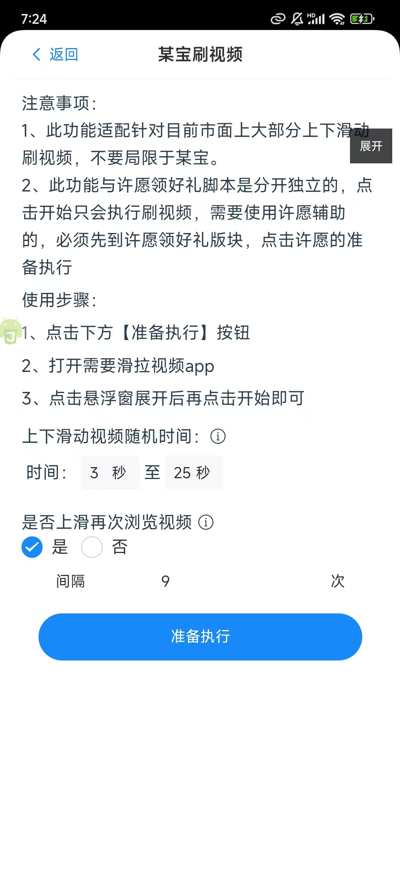

### 前言

某宝中可以通过不断的浏览视频获取到红包，在悠然助手许愿版中实现了完全随机化浏览视频，当然这个功能也适配在其它刷视频的app中，像某东、某手、某音等等。   

### 使用方式

#### 第一步、打开悠然助手许愿版->某宝刷视频

#### 第二步 配置相关配置
参数说明：  
第一个配置选项是：上下滑动视频随机时间  
默认是3到25秒，可以通过这个配置项来控制视频的浏览时长，在配置这个时间长短的时候，尽量把间隔拉长，不然很容易被认为是辅助刷。另外把这个时间拉长了，就可以刷支付宝的短剧了。  
第二个配置选项是：是否上滑再次浏览视频  
选择是，则需要配置一个数字，在浏览完几次后，上滑一次，目的是为了更好的随机浏览视频，选择否，则只会一直往下滑  
#### 第三步 配置好后点击准备执行。

#### 第四步 进入到app中，点击开始。
