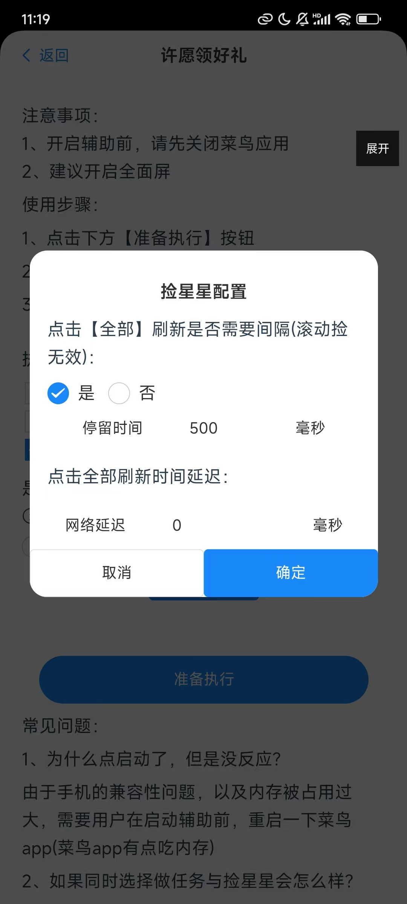

### 前言

除了许愿可以捡之外，越买越省钱捡抽奖劵、包裹星球捡碎片、地图寻宝捡体力、天天领红包捡金豆，都是有东西可以捡的，这个通用捡兼容了所有版本的能力

### 使用方式

#### 第一步、打开悠然助手许愿版菜鸟许愿领好礼管理页面

#### 第二步 配置相关配置
参数说明：  
第一个配置选项是：是否滚动捡星星(碎片、体力、金豆、抽奖劵)  
选择是，表示会一边滚动一边捡星星，选择否，表示不滚动，只会点击全部全部，捡第一个红条  
第二个配置选项需要点击按钮--配置捡星星功能  
  
第二个配置项：点击【全部】刷新是否需要间隔(滚动捡无效)  
选择是，则需要输入间隔时间。点击全部刷新，然后点击红条，记一轮，当一轮结束后，会等待配置的时间再继续点击全部刷新  
选择否，则不等待 直接点击全部刷新  
  

第三个配置项是：点击全部刷新时间延迟  
有些朋友的网络可能会反应比较慢，可以通过这个配置来延迟点击。即在点击全部刷新后，会等待配置好的时间，再去点击红条时间。

  
  注意：弹出框里的配置只针对点击全部刷新，滚动捡星无效果