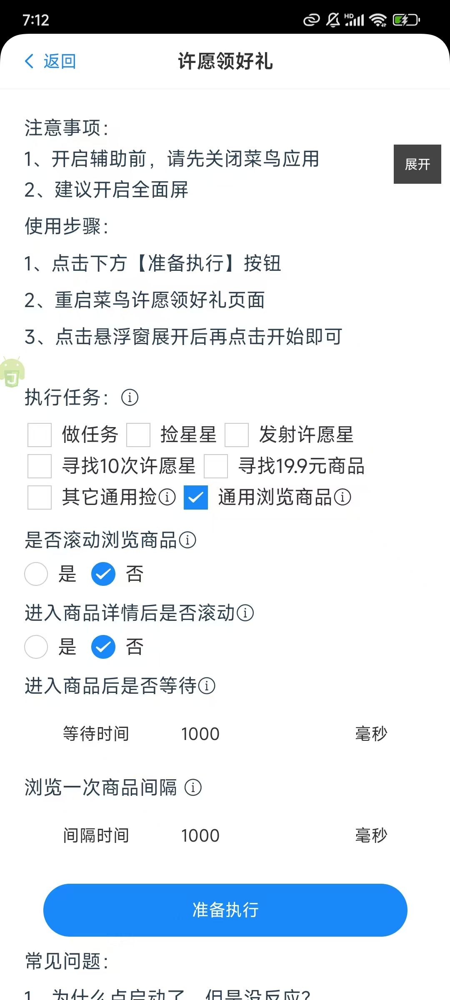
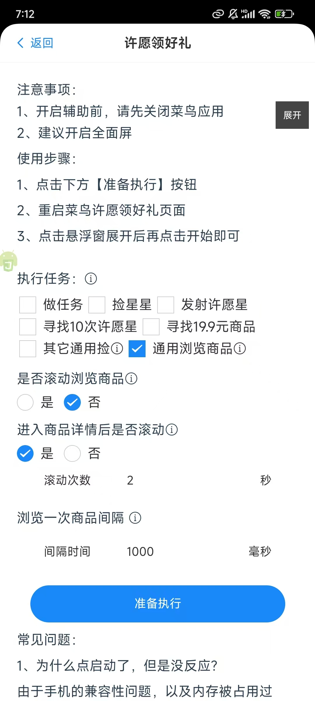

### 前言

在cn应用中包裹星球、地图寻宝都有升级的任务，我们可以通过浏览商品的方式来获取升级等级以获取更多的奖励。

### 使用方式

#### 第一步、打开悠然助手许愿版菜鸟许愿领好礼管理页面

  
  选择通用浏览。  
#### 第二步 配置相关配置
参数说明：  
第一个配置选项是：是否滚动浏览商品
选择是，表示会滚动1次浏览1次商品，选择否，表示不滚动，只会点击全部刷新，浏览第1个商品。  

第二个配置选项是：进入商品详情后是否滚动  
选择是，表示进入到商品详情后，会滚动配置好的滚动次数。选择否，则会有一个是否停留的输入框  
即：停留时间：  

  

配置后，在进入商品详情后会停留配置的时间，单位是毫秒。  

#### 第三步 配置好后点击准备执行。

#### 第四步 进入到许愿领好礼页面，点击开始或者点击快捷悬浮窗中的通用浏览

