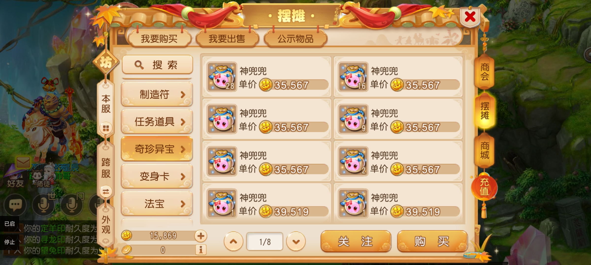

### 前言
在梦幻西游手游中有很多的道具，包括非珍品、珍品等商品，玩家在上架非珍品的时候，有时候价格会压的很低，但是我们不可能时刻盯着商城价格，所以写了这么一个秒非珍的功能，当价格低于设定的价格时，就会自动点击购买，帮忙玩家秒到期望价格的商品。

### 使用方式
第一步：进入游戏找到要秒的非珍商品
  
  第二步：到悠然助手中配置好价格（包括识别最低价格、商品最低价、商品最高价）
  
  第三步：点击 开始执行按钮
  
  第四步：切换回游戏中，点击开始按钮即可

  

### 视频教程
[梦幻西游手游非珍秒货视频教程](https://mp.weixin.qq.com/s/5QXuahUUgm1qSuJ4wxX9Fw)