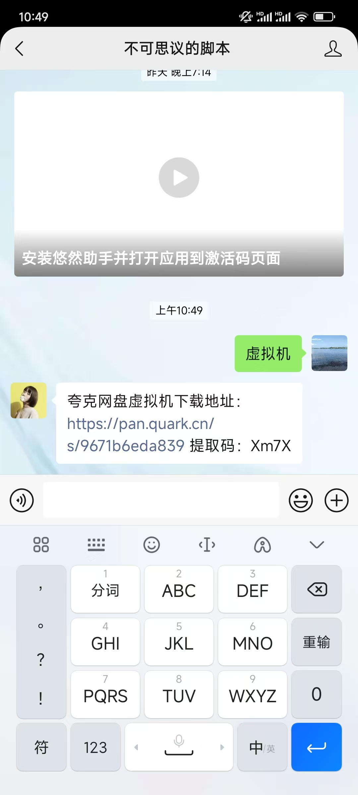

### 前言：
对于一些没有相应分辨率手机的朋友，可以考虑在手机上安装一个虚拟机
  
  作者使用的虚拟机软件：vmos pro

### 怎么获取
关注公众号：
  
  

  
  在公众号页面回复 【 虚拟机 】即可获取下载地址与使用说明
  
  

### 注意事项
虚拟机的安装事项说明，直接参考网盘附带的教程，激活不了 建议多看几次教程内容

[安装完成后查看如何使用](https://mp.weixin.qq.com/s/72sJwMx5Fz-fjfPNchgeWg)

### 接下来
接下来环境配置完后，就可以开始使用悠然助手软件啦~ 介绍如何使用一键日常