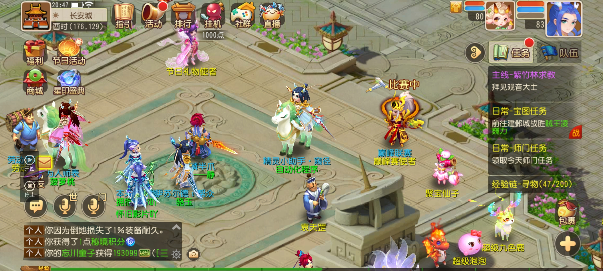

### 前言

梦幻西游手游中剑会活动每周都有6000金币与150万银币的奖励，但是要用户打满10场，10场打完也是要花费好多时间，其中等待、挂机、战斗就要花好多的时间，这个功能将把这些功能都自动化了，减少用户的重复劳动

### 使用方法
梦幻西游手游剑会自动挂机功能中首次使用了跳转账号登录与多账号功能的同时使用，并且多账号是和一键日常、自动三界与科举是统一账号的，可以节省账号的配置的时间。
  
  > 跳过账号登录的方式直接挂机启动
    
    第一步：进入本页面，点击下方【开始执行】按钮
    
    第二步：启动梦幻西游手游app
    
    第三步：进入到游戏中即可

  

      第四步：点击悬浮窗口【开始】按钮即可

  > 多账号功能使用方式
    

  多账号的使用方式其实就和[一键日常](/help/ga7ah6kh/)是一样的了，只要配置好大区下的多角色即可
    
    以下是视频使用介绍：
[梦幻西游手游剑会自动挂机功能使用介绍--悠然助手](https://mp.weixin.qq.com/s/sGv1p7Sg1M7wpScEyzHERw)