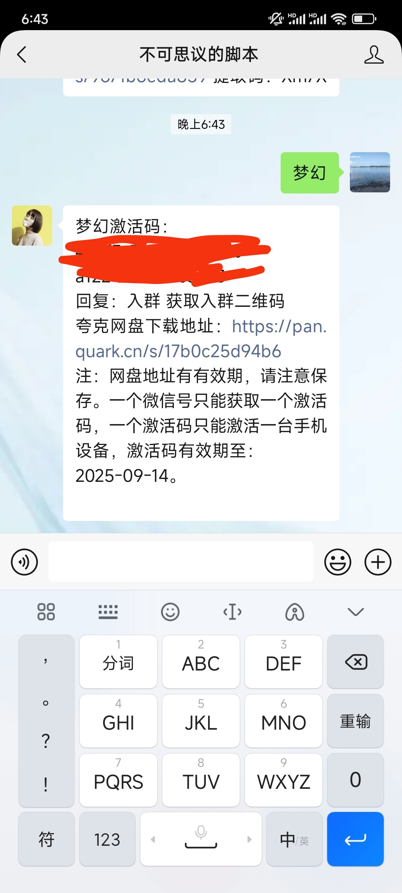

## 从这里开始

### 第一步：关注公众号获取激活码

### 第二步：公众号中回复 【 梦幻 】获取激活码

  
  注：一个微信号只能获取一个激活码，一个激活码只能激活一台设备

### 第三步：下载app并安装
点击上方公众号返回的网盘链接下载安装包

### 第四步：安装app
  安装好app后，需要赋予一些权限才可以打开，以下以我的手机小米为例，后续补充其它手机型号  
  [视频教程](https://mp.weixin.qq.com/s/0J17Xd1mhK8psx_yobjKAQ)
### 第五步：激活
  输入激活码激活即可

### 注意事项
  对于手机的要求：
  
  分辨率：1080x2400

  屏幕比例：16:9

  安卓9以上
如果没有合适的分辨率手机 请看下一篇文章