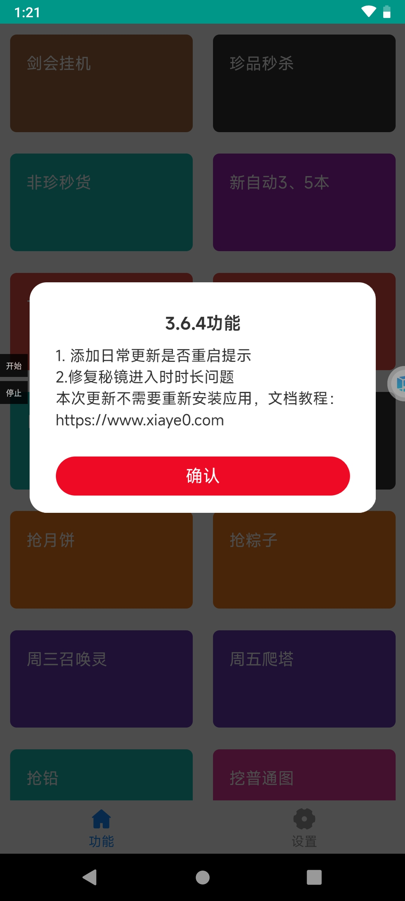
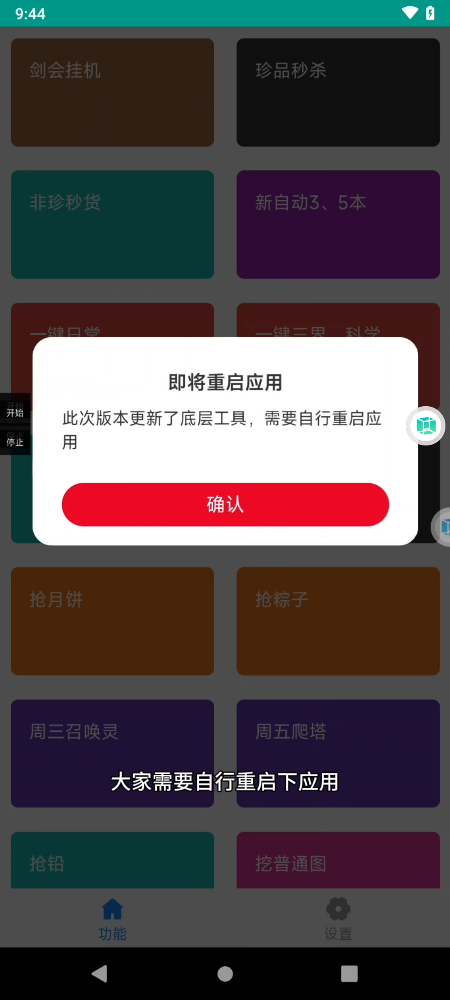

### 前言
在使用悠然助手的过程中，有些朋友会发现明明之前是好的，这一次用就不行了，这个其实有多方面因素，有些是因为自己在更新时候验证未完全，本地跑了没问题就发线上去了，有些是bug没处理好，还有一个原因更新了底层工具库，然后朋友没有重启，针对没有重启的这个问题，我这次了一个单独的提示。

  
  在日常更新后，用户进入悠然助手的时候，会有一个日常更新的提示，这个内容是此次更新的内容
  
  
    
    在点击确定之后，如果需要应用重启还会有另外一个提示：
    
  
    
    当发现有这样的一个提示的时候，就需要用户主动把应用重启一下。
  
  ### 视频教程
  以下是视频教程，如果有不明白的地方可以参考这个视频：

  [悠然助手更新的什么时候需要重启应用](https://mp.weixin.qq.com/s/UbsqXFm6EGKFMvpGOP1jww)