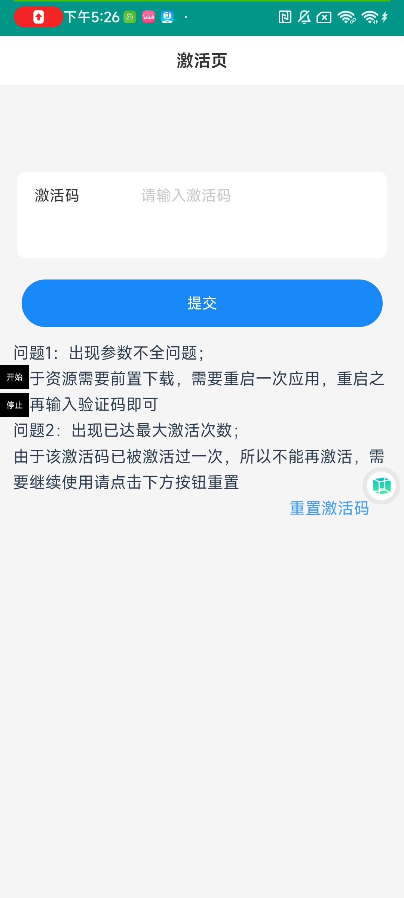
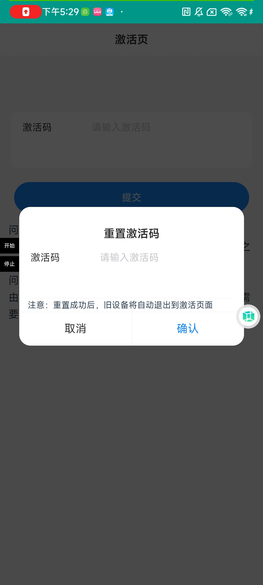

## 前言
由于悠然助手的激活码一个用户只能激活一台设备，一个用户也只能获取一次激活码，这就会有一个限制，万一激活错设备了就麻烦了，只能找作者重置激活码了，这事老夏已经干了超级多次了，今天新更新的这个功能朋友们在新的设备上就可以自主重置激活码了

## 使用方法
第一步：在悠然助手中激活页面：
  
  
  
  第二步：在右下角找到重置激活码按钮，点击重置激活码
    
  
  
  第三步：输入要重置的激活码（激活码需要关注【不可思议的脚本】获取），点击确定即可

## 注意事项
1.  重置激活码后，原先激活的机子将无法继续使用，会退回到激活页面
2.  朋友们可以随意重置激活码，无限套娃

## 视频教程

[梦幻西游手游辅助如何重置激活码视频教程](https://mp.weixin.qq.com/s/0C7PMI85KMxX8v1_GL03QQ)