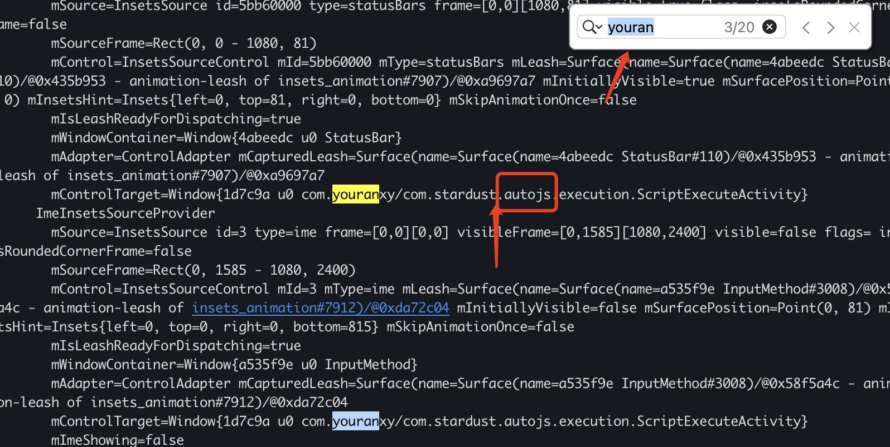

## 大厂APP里的活动黑号怎么办？

### 前言
最近一周都没有去更新悠然助手了，原因是跑去做其它的了，有个很有意思的脚本可以写，是大厂里搞的活动，里面有涉及到一些活动，满足什么条件然后给一些奖励，基本上是看商品、浏览商品、分享、签到之类的，都是一些固定式的点击，滑动，像这种类型的任务就特别适合做脚本了，于是便开始开发。

### 遇到问题
说实话，整体的脚本任务开发起来不算难，大概前后花了1天的时间把整个流程走完了，后续在朋友的建议下又花了2天的时间做了优化，加快了速度，提高了整体任务的流畅性。
  
  在我即将要分享给其它朋友使用时，发现了一个非常严重的问题---黑号。
  
  啥是黑号？
    
    黑号是大厂对不良用户的定义，一旦被大厂定义成黑号，则获取奖励的概率会降低，最低的那种，不管你有多努力，你都不可能获得相应的奖励。

  那么问题来了？你一个正常玩家，是怎么变黑的呢？

### 我的账号是怎么变黑的？

我从以下几个角度来分析：

#### 第一：软件层面
像这些固定式的点击方式，大厂怕什么，就是怕一些人不走寻常路，找了一些方案不花时间去点、去看，手机呢在那里运行，人呢跑走了，要我是老板我也讨厌！所以怎么处理？
  
### i：监听应用。
目前市面上有哪些专门做这类自动化工具的？其实autojs就是被各大大厂所厌恶，于是就有专门针对这类脚本逻辑判断：
像
  
  
  
  上面这张图片是我在运行一个autojs打包的应用时候显示的，这个应用的后缀就跟着autojs，我猜想大厂的判断逻辑是这样的
  
  当机子开启的无障碍模式的时候，并且这个机上有监听到了autojs的应用，那么这台机子99%的概率就是跑脚本辅助了，那么不好意思，这台机上上对应的账号就会被标记成黑号了。

这个是我实践出来的，怎么实践呢？
  
  第一步：找了一台可以随时重置的手机，我在这台手机安装了大厂应用，打开大厂应用，所显示的操作症状是白号的

  第二步：在这台手机上安装autojs打包的应用，，这个时候启动我先启用autojs应用包，然后关闭，去查看大厂应用账号是否黑号，结果在没有运行的情况下显示白号，这一步就验证了大厂应用不会监听用户安装了什么

  第三步：验证无障碍。我在手机上打开了爱奇艺应用，打开了它的无障碍功能，然后再打开大厂应用，去查看大厂应用账号是否黑号，结果是也是白号，这一步就验证了大厂应用对无障碍并不敏感。

  第四步：我把autojs应用无障碍权限下了，只打开autojs应用，结果是白号。
  
  最后一步：我把autojs应用与无障碍权限同时打开，只有这种情况下是黑号

##### 最后总结
  只要两者同时存在时，才会有被黑号的可能性，刚好这个应用同时满足，只能说大厂对autojs还是很不喜欢的，但是对于无障碍，他们是肯定不敢禁止的，一旦禁止，对于大厂来说可能就会有舆论风波了。

### ii: 用户行为监听
  
  这个方式就会有点玄乎了，主要做的是监听用户在大厂上的行为，动作等过程，通过判断这些动作是固定的呢，还是有规律的，来确定这个人是不是通过脚本的方式来获取奖励的。
  
  举个例子：
  
  虚拟账号
  滚动直线  
  固定点击  
  长时间做一件非常固定的事  
  其实这些只要大厂愿意去做，还是能够很容易分析出来的。
    
  

### 如何防止呢？
  
  要避免以上的一些情况，其实最简单的方便就是让你的脚本的行为更像人操作的行为，曲线滚动、非长时间固定点击某个按钮或者功能、不要长时间去玩这个游戏，这样也很容易让系统以为你不是人为的操作。
  
  不要出现那种虚拟手机注册的虚拟账号，这种账号也是迟早被黑。
  
  
  欢迎关注我的公众号：
    
  

回复【许愿】即可获取悠然助手许愿脚本打卡软件
